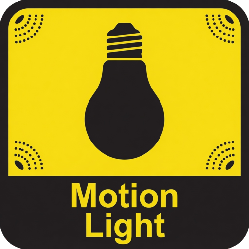

English | [Русский](README.ru.md)
#  </img> Motion Light

A smart, FSM-based custom integration for Home Assistant to control lights based on motion, illuminance (lux), and manual overrides.

## Key Features

- **Smart Motion Control:** Supports main triggers (to turn on) and extend sensors (to keep on).
- **Illuminance Check:** Only turns on lights if the ambient light is below a specified threshold.
- **Manual Override Detection:** Intelligently detects when a user manually turns the light on or off and adjusts its behavior to avoid conflicts.
- **Customizable Timers:** Motion filter (debounce), off-delay, and various cooldowns.
- **Force Stop:** Supports a dedicated sensor to instantly turn off the light and pause automation.
- **UI Configuration:** Fully configurable via Home Assistant Config and Options flows.

## How It Works

The integration uses a Finite State Machine (FSM) to manage states. The main states are:
- **Idle / Detecting:** Waiting for motion or processing a trigger.
- **On / Delaying / Active:** Light is on. "Delaying" means motion stopped, waiting for the off-delay timer. "Active" means motion was detected during the delay, resetting the timer.
- **Manual On:** Light was turned on manually. It will stay on until manually turned off or until the "Forgot to turn off" timer expires.
- **Manual Off Cooldown:** Light was turned off manually. The integration ignores motion sensors for a set period to prevent the light from turning right back on.

## Installation

1. Copy the `motion_light` folder to your `custom_components` directory, or install it via HACS.
2. Restart Home Assistant.
3. Go to **Settings > Devices & Services > Add Integration** and search for **Motion Light**.

## Configuration

During setup, you will be asked to provide:
- **Main triggers:** Sensors that can turn the light on (e.g., motion sensors).
- **Extend sensors:** Sensors that only reset the off-delay timer but cannot turn the light on from an idle state (optional).
- **Controlled switches:** The lights/switches to control.
- **Illuminance sensor:** Sensor to check ambient light levels (optional).
- **Force stop sensor:** Optional sensor to force the light off (optional).

## Entities

Once configured, the integration creates the following entities:

**Sensor:**
- **Status:** Shows the current FSM state (Idle, On, Delaying, Manual On, etc.).

**Switches:**
- **Control (Enabled):** Globally enables or disables the integration.
- **Manual priority:** Enables or disables the manual override detection.

**Numbers (Settings):**
- **Motion filter:** Delay before turning on after motion is detected (debounce).
- **Off delay:** How long to wait after motion stops before turning off.
- **Lux threshold:** Maximum light level at which the automation is allowed to turn on.
- **Lux cooldown:** Time to ignore the lux sensor after turning off (prevents flickering).
- **'Forgot to turn off' timer:** How long a manually turned-on light stays on before auto-shutoff. *Set to 0 to disable auto-shutoff in manual mode.*
- **Manual off cooldown:** How long to ignore motion sensors after a manual turn-off.